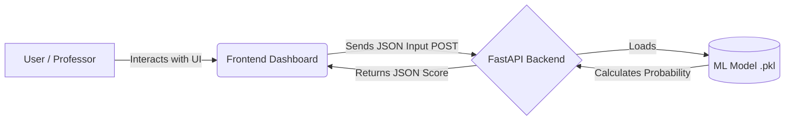

<div align="center">
  
# 🚀 Telco Customer Churn Prediction - End-to-End MLOps

[](https://github.com/Soham/churn-project/actions)
[](https://www.python.org/downloads/release/python-3110/)
[](https://fastapi.tiangolo.com/)
[](https://scikit-learn.org/)

An industry-grade Machine Learning Operations (MLOps) pipeline that predicts whether a telecommunications customer will stop using their service (churn), featuring a highly interactive presentation dashboard and automated deployments.

[Report Bug](https://github.com/Soham/churn-project/issues) · [Request Feature](https://github.com/Soham/churn-project/issues)

---

### 🌐 LOCAL APPLICATION
**[👉 Click here to open the Interactive Dashboard](http://localhost:8000)**

</div>

## 📖 Project Description

Customer retention is one of the most critical metrics for any subscription-based business. This project utilizes historical customer data (demographics, services used, account details) to predict the probability of a customer cancelling their subscription. 

By identifying "High Risk" customers early, businesses can proactively offer targeted incentives, significantly improving customer retention and revenue.

## 💼 Business Use Case

In the telecommunications industry, acquiring a new customer is 5-25x more expensive than retaining an existing one. This ML model allows businesses to:
- **Reduce Marketing Costs:** Target retention campaigns only to users who are actually at risk.
- **Improve Customer Lifetime Value (CLV):** Keep users on the platform longer.
- **Understand Churn Drivers:** Analyze which factors (e.g., high monthly charges or lack of tech support) cause users to leave.

## 📊 Dataset Information

The model was trained on the standard **Telco Customer Churn Dataset**, containing:
- **Demographics:** Gender, Age (Senior Citizen), Partners, Dependents.
- **Services:** Phone, Multiple Lines, Internet (DSL/Fiber optic), Tech Support, Streaming.
- **Account Data:** Contract type, Payment method, automated billing, Monthly/Total charges.
- **Target Variable:** `Churn` (Yes / No).

## 🛠 Technology Stack

- **Machine Learning:** Scikit-Learn (Logistic Regression / Random Forest), Pandas, NumPy
- **MLOps & Tracking:** DVC (Data Version Control), MLflow (Experiment tracking)
- **Backend API:** FastAPI, Uvicorn, Joblib
- **Frontend / Dashboard:** Vanilla HTML/CSS/JS (Glassmorphism UI)
- **CI/CD & DevOps:** GitHub Actions, Docker, Pytest

## 🧠 Machine Learning Model Used

We evaluated multiple algorithms and chose **Logistic Regression / Random Forest** due to their excellent balance of accuracy, fast inference speed, and high interpretability. The model dynamically accepts input payloads, performs categorical encoding on the fly, and outputs both a binary prediction and a probability percentage.

## ⚙️ MLOps Pipeline Explanation

1. **Data Collection:** Raw CSV data is pulled and tracked using DVC to ensure reproducibility.
2. **Data Preprocessing:** Missing values are handled, and categories are encoded (`pd.get_dummies`) using `src/preprocess.py`.
3. **Feature Engineering:** Important variables (like highly correlated service usage) are highlighted.
4. **Model Training:** `src/train.py` fits the algorithm. We use MLFlow to log metrics (Accuracy, F1-Score).
5. **Model Evaluation:** `pytest` rigorously tests the prediction shapes and edge cases in `tests/test_model.py`.
6. **Model Saving:** The best performing model is serialized into a `.pkl` file via `joblib`.
7. **API Integration:** FastAPI binds the model to a `POST /predict` HTTP endpoint.
8. **Deployment:** Docker wraps the entire ecosystem, and GitHub Actions automatically pushes updates.
9. **Prediction Pipeline:** The Frontend UI consumes the FastAPI endpoint in real-time.

## 🤖 CI/CD Pipeline Explanation

Our CI/CD (Continuous Integration & Continuous Deployment) pipeline makes sure our code is always working and ready.

- **Continuous Integration (CI):** Every time code is pushed to GitHub, an automated robot boots up a fresh computer, installs our libraries, and runs our tests. If anything is broken, we are alerted immediately.
- **Continuous Deployment (CD):** Once the tests pass, GitHub Actions packages our entire project into a **Docker Container** (a mini-shipping box with everything needed to run the app) and pushes it to an online registry so servers can pull the latest version!

## 📏 Project Architecture



## 💻 Installation & Running Locally

Follow these steps to run the exact environment on your own computer:

**1. Clone the repository:**
```bash
git clone https://github.com/Soham/churn-project.git
cd telco-churn-mlops
```

**2. Install dependencies:**
```bash
pip install -r requirements.txt
```

**3. Run the ML Pipeline (Generates Model!):**
```bash
# This recreates the churn_model.pkl file using your raw data
dvc repro
```
*(If you do not have DVC configured, run `python generate_dummy.py` instead to create a fast presentation model)*

**4. Start the Application Server:**
```bash
uvicorn api.main:app --reload
```
**5. Open Dashboard:**
Visit `http://localhost:8000` in your web browser!

## 🖼 Dashboard Screenshots

### Overview & Prediction UI
 

When telemetry is entered, the engine executes inference in real-time to alert admins of churn risks.

## 🚀 Future Improvements

- Switch to asynchronous inference for handling massive traffic.
- Implement XGBoost or LightGBM for potentially higher accuracy.
- Add SHAP values to the dashboard to show the user exactly *why* the model made its decision.

## ✒️ Author Information
**Soham** - Student & Aspiring ML Engineer
- **GitHub:** [@Soham](https://github.com/Soham)

---
*This repository was built for academic evaluation, showcasing a complete end-to-end understanding of Machine Learning and MLOps practices.*
